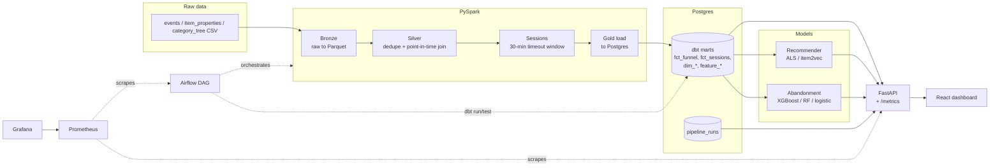
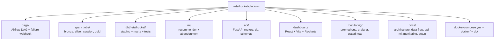

# RetailRocket E-commerce Intelligence Platform

A batch data platform over the [RetailRocket e-commerce dataset](https://www.kaggle.com/datasets/retailrocket/ecommerce-dataset).
It reconstructs user sessions from raw clickstream events, builds analytics and feature
tables with a medallion (Bronze/Silver/Gold) layout, trains two models on top of them, and
serves the results through an API and a small React dashboard. Airflow orchestrates the
batch run; Prometheus and Grafana watch it.

The dataset is real (~2.7M events, ~20M item-property rows); the point of the project is the
engineering around it — a correct point-in-time join, session reconstruction with window
functions, dbt-tested marts, and a reproducible local stack.

## What it does

- **Funnel / conversion analysis** — view → cart → purchase, aggregated by category and day.
- **Product recommendation** — item-to-item, ALS baseline with an item2vec alternative behind
  the same interface, plus a co-purchase fallback for cold-start items.
- **Cart-abandonment prediction** — per-session classifier (XGBoost baseline, algorithm
  selectable via config), trained on a time-based split to avoid leakage.
- **Dashboard** — funnel chart, top items by conversion, a recommendation demo, and a
  pipeline-health tab backed by a run-history table.

## Architecture



A more detailed version is in [`architecture.mermaid`](architecture.mermaid), and the
step-by-step data narrative is in [`docs/data-flow.md`](docs/data-flow.md).

## Tech stack

| Layer | Choice |
|---|---|
| Orchestration | Airflow (daily batch, LocalExecutor) |
| Processing | PySpark 3.5 |
| Bronze/Silver storage | Parquet on local filesystem, partitioned by date |
| Gold storage + modeling | Postgres + dbt |
| Recommendation | ALS (Spark MLlib), item2vec alternative |
| Abandonment | XGBoost / RandomForest / logistic (config-selectable) |
| Serving | FastAPI + Pydantic |
| Dashboard | React + Vite + Recharts |
| Monitoring | Prometheus + Grafana, structured JSON logs, `pipeline_runs` table |
| Infra | Docker Compose (single host) |

Why each piece was chosen: [`docs/architecture.md`](docs/architecture.md).

## Repository layout



## Getting started

### Prerequisites

- Docker + Docker Compose (for the full stack)
- For running jobs directly outside Docker: Python 3.10+ and **JDK 17** (Spark 3.5 does not
  run on JDK 21+)

### Get the dataset

Download the RetailRocket dataset from Kaggle and unzip these files into `data/raw/`:

```
data/raw/
├── events.csv
├── item_properties_part1.csv
├── item_properties_part2.csv
└── category_tree.csv
```

### Reproduce — full stack (Docker Compose)

```
cp .env.example .env          # adjust credentials / webhook if you want
docker compose up -d --build
```

This starts Postgres, Airflow (webserver + scheduler), the API, Prometheus, Grafana, and a
statsd-exporter. Then:

1. Open Airflow at http://localhost:8080 (admin / admin).
2. Unpause and trigger the **retailrocket_pipeline** DAG. It runs
   bronze → silver → sessions → gold → `dbt run`/`dbt test` → train recommenders + abandonment.
3. When it finishes, the API (http://localhost:8000/docs) serves data and the Grafana
   dashboard (http://localhost:3000) populates.

The dashboard runs outside Docker — see below.

### Reproduce — locally, step by step

```
pip install -r requirements.txt
export JAVA_HOME=/path/to/jdk-17

python spark_jobs/bronze_ingest.py
python spark_jobs/silver_transform.py
python spark_jobs/session_builder.py
python spark_jobs/feature_gold.py             # loads Postgres over JDBC

dbt run  --project-dir dbt/retailrocket --profiles-dir dbt/retailrocket
dbt test --project-dir dbt/retailrocket --profiles-dir dbt/retailrocket

python ml/recommender/train_als.py
python ml/recommender/train_item2vec.py
python ml/abandonment/train.py --all          # trains + compares algorithms

uvicorn api.main:app --reload                 # http://localhost:8000
```

Full details, including a throwaway Postgres for local dev, are in
[`docs/setup.md`](docs/setup.md).

### Dashboard

```
cd dashboard
npm install
npm run dev                                   # http://localhost:5173, proxies to the API
```

## Documentation

| Doc | Contents |
|---|---|
| [architecture.md](docs/architecture.md) | System overview and the reason behind each tech choice |
| [data-flow.md](docs/data-flow.md) | How data moves layer by layer; the point-in-time join in plain language |
| [api.md](docs/api.md) | Endpoint reference with request/response examples |
| [ml.md](docs/ml.md) | Features, split strategy, metrics, and algorithm comparison |
| [monitoring.md](docs/monitoring.md) | Metrics, `pipeline_runs`, and reading the Grafana dashboard |
| [setup.md](docs/setup.md) | Running everything locally, end to end |

## Tests

```
export JAVA_HOME=/path/to/jdk-17
pytest tests/                                 # runs against fixtures under tests/, no Postgres needed
```

## Scope

Single-host batch by design: no Kubernetes, no multi-node Spark, no Kafka/streaming, and no
cloud-specific deployment. The logging format, run-history table, and recommender interface
are structured so those could be added later without a redesign.
